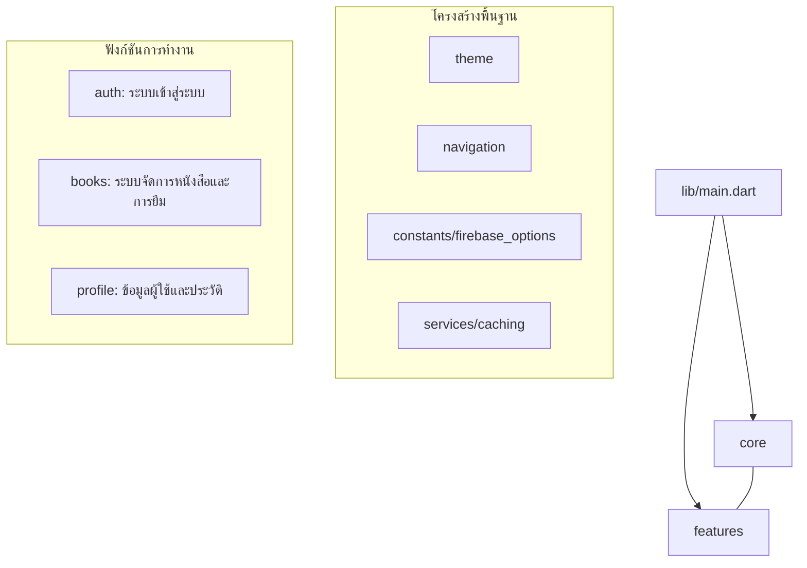
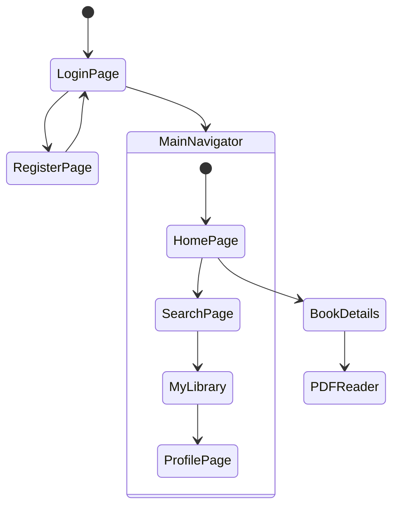
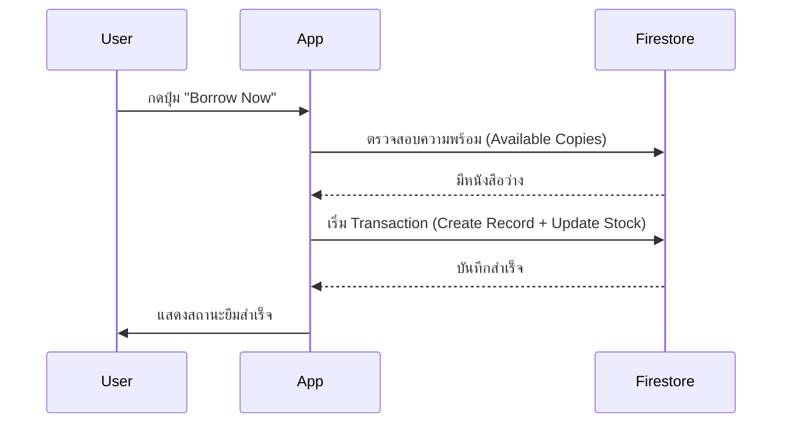

# รายงานโครงงานวิชา Mobile Development (Individual Project)
## ชื่อโปรเจกต์: **Book Library - แอปพลิเคชันห้องสมุดดิจิทัล**

---

### 1. วัตถุประสงค์ (Project Objective)
เพื่อพัฒนาแอปพลิเคชันมือถือที่ใช้งานได้จริง (Usable App) โดยเน้นความสวยงามของ User Interface (UI) และความลื่นไหลของ User Experience (UX) แอปพลิเคชันนี้ถูกออกแบบมาเพื่อช่วยให้นักศึกษาสามารถเข้าถึง ข้อมูลหนังสือ การยืม และการอ่านหนังสือผ่านระบบดิจิทัลได้อย่างสะดวกและรวดเร็ว

**คุณสมบัติหลัก:**
- ระบบสมาชิกและบทบาทผู้ใช้ (User/Admin)
- การสืบค้นหนังสือตามหมวดหมู่และชื่อ
- ระบบการขอยืมหนังสือแบบ Transaction
- เครื่องมือการอ่านไฟล์ PDF ในตัวแอป
- ระบบจัดการประวัติการอ่านและหนังสือเล่มโปรด

---

### 2. โครงสร้างของระบบ (Project Architecture)
แอปพลิเคชันถูกออกแบบโดยใช้โครงสร้าง **Feature-based Layered Architecture** เพื่อให้ระบบมีความโปร่งใส จัดการโค้ดได้ง่าย และรองรับการขยายตัวในอนาคต



**รายละเอียดโฟลเดอร์:**
- `lib/core`: บรรจุ Shared Infrastructure เช่น ธีมแอป (Dynamic Theme), การตั้งค่า Firebase และวิดเจ็ตสากล
- `lib/features`: แบ่งตามโมดูลหลักของแอป (Books, Auth, Profile) โดยแต่ละโมดูลจะมี `pages`, `services`, `models`, และ `widgets` ของตัวเอง

---

### 3. วิจเจ็ตและไลบรารีที่ใช้ (Widgets & Packages)
แอปพลิเคชันนี้เลือกใช้ Packages จาก **pub.dev** เพื่อเพิ่มประสิทธิภาพการทำงาน ดังนี้:

| Package | หน้าที่และความสำคัญ |
|:---|:---|
| `cloud_firestore` | จัดเก็บข้อมูลหนังสือ ประวัติการยืม และข้อมูลผู้ใช้แบบ Real-time NoSQL |
| `firebase_auth` | จัดการระบบความปลอดภัยและการยืนยันตัวตนผู้ใช้ |
| `syncfusion_flutter_pdfviewer` | สำหรับการอ่านหนังสือในรูปแบบ PDF ภายในแอปที่มีประสิทธิภาพสูง |
| `cached_network_image` | จัดการโหลดรูปหน้าปกหนังสือพร้อมระบบ Caching เพื่อลดการใช้ Data |
| `shimmer` | สร้างเอฟเฟกต์การโหลด (Skeleton Loading) เพื่อ UX ที่ดี |
| `shared_preferences` | บันทึกการตั้งค่าธีม (Dark/Light mode) และตัวเลือกสีของผู้ใช้ |

---

### 4. การเชื่อมต่อ Web Service และ API (Firebase Integration)
แอปพลิเคชันนี้ใช้งาน Web Service ผ่าน Firebase โดยมีการใช้งานครบทั้ง 3 แบบตามข้อกำหนด:

#### 1. การดึงข้อมูล (GET / Fetch Data)
ใช้การดึงข้อมูลรายชื่อหนังสือจาก Firestore มาแสดงผลในหน้าแรก (Home Page) และหน้าค้นหา (Search Page)
```dart
// ตัวอย่างการดึงข้อมูลหนังสือตามหมวดหมู่
Stream<List<Book>> getBooksByCategory(String category) {
  return _booksCollection
      .where('categories', arrayContains: category)
      .snapshots()
      .map((snapshot) => snapshot.docs.map((doc) => Book.fromFirestore(doc)).toList());
}
```

#### 2. การเพิ่มและแก้ไขข้อมูล (POST / Transactions)
การยืมหนังสือใช้ระบบ **Firestore Transactions** เพื่อป้องกันข้อผิดพลาดในการทำรายการพร้อมกัน (Race Conditions) โดยจะทำการเพิ่ม Record การยืมและลดจำนวนหนังสือคงเหลือไปพร้อมกัน
```dart
// ตัวอย่างระบบ Transaction การยืมหนังสือ
await FirebaseFirestore.instance.runTransaction((transaction) async {
  // 1. ตรวจสอบจำนวนเล่มคงเหลือ (Read)
  // 2. บันทึกข้อมูลการยืมใหม่ (Write)
  // 3. ปรับปรุงจำนวนหนังสือในคลัง (Update)
});
```

#### 3. การอัปเดตข้อมูลแบบสด (Stream / Real-time)
ใช้ `StreamBuilder` ในการเฝ้าสังเกตสถานะการยืมหนังสือ ทำให้หน้าจอของผู้ใช้อัปเดตได้ทันทีเมื่อมีการเปลี่ยนแปลง

---

### 5. ผังการทำงานของแอปพลิเคชัน (App Flow)

#### แผนผังการนำทาง (Navigation Flow)


#### กระบวนการยืมหนังสือ (Borrow Logic Flow)


---

### 6. สรุปความสวยงามและการออกแบบ (Design & UI/UX)
แอปพลิเคชันเน้นความพรีเมียมด้วยเทคนิคสมัยใหม่:
- **Dynamic Theming**: ผู้ใช้สามารถเปลี่ยนโทนสีของแอปได้ตามใจชอบ (Ocean, Sunset, Forest)
- **Micro-animations**: มีการใช้ Shimmer Effect ขณะโหลดข้อมูล และ Hover/Tap Animation สำหรับปุ่มกด
- **Role-based UI**: อินเทอร์เฟซจะปรับเปลี่ยนตามบทบาทของผู้ใช้ (Admin จะเห็นเมนูสำหรับจัดการหนังสือ)

---

### 7. ตัวอย่างโค้ดที่สำคัญ (Code Implementation)

**ไฟล์:** `lib/features/books/services/borrow_service.dart`
*อธิบาย: โค้ดส่วนนี้คือหัวใจของการเรียกใช้งาน Web Service แบบ Transaction เพื่อจัดการข้อมูลการยืม*

```dart
// การทำ Transaction เพื่อความถูกต้องของข้อมูล
static Future<void> borrowBook({required Book book, required String userId}) async {
  await BaseService.firestore.runTransaction((transaction) async {
    // อ่านข้อมูลจำนวนหนังสือล่าสุดจาก Server
    final bookDoc = await transaction.get(_booksCollection.doc(book.id));
    final currentAvailable = bookDoc.get('availableCopies') as int;
    
    if (currentAvailable <= 0) throw Exception('สินค้าหมด');

    // สร้าง Record ใหม่
    final newRecordRef = _borrowCollection.doc();
    transaction.set(newRecordRef, {
      'userId': userId,
      'bookId': book.id,
      'status': 'active',
      'date': DateTime.now(),
    });

    // อัปเดตสต็อกหนังสือทันที
    transaction.update(_booksCollection.doc(book.id), {
      'availableCopies': currentAvailable - 1,
    });
  });
}
```
